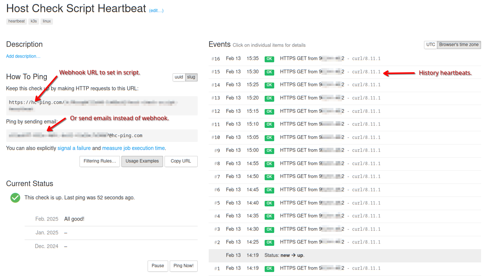

# Enable Heartbeat Monitoring

A heartbeat monitor is used to make sure this script executes properly at the expected intervals. See [Create systemd timers](./create_systemd_timer.md) as an example for running this script at set intervals.

Example: This script scans all hosts every 5 minutes. Upon completion of the script it sends a heartbeat notification to a monitoring service which expects this notification every 5 minutes. However if something goes wrong and the script fails to send its heartbeat then an alert can be triggered by the monitoring service that this script has failed to send its heartbeat within the expected interval.

An example of a service you can use is [healthchecks.io](https://healthchecks.io/) which provides a generous free tier.

My dashboard from *healthchecks.io*:



---

## To Enable Heartbeats

Edit the configuration file.

* The default location is: `$HOME/.config/host-check/host-check.conf`
  * An alternate file can be specified with the `--config` parameter.

Set the values:

```text
# Webhook to "monitor the monitor". Send notification on each run to healthchecks.io
# to get an alert if this stops running.
healthcheck="https://<webhook_uti_here>"

# Set to 1 to enable heart beat health check, anything else to disable.
enable_healthcheck=0
```

Where:

* `healthcheck` is the URL shown above in the `How to Ping` section.
* `enable_healthcheck` is set to `1` to enable or `0` to disable.

Each time the script is run with the `-a` or `--all` switch (to process all hosts) the heartbeat will be triggered. This is defined within the `__send_heartbeat()` routine.

In the example below, `host-check.sh` is being run by `systemd timers` and it's output can be checked with `journalctl`:

```shell
$ journalctl -b -f | grep "host-check.sh"

Feb 13 15:45:01 dldsk01 host-check.sh[3617374]: Connection to k3s02 (192.168.10.216) 46359 port [tcp/*] succeeded!
Feb 13 15:45:01 dldsk01 host-check.sh[3617375]: Connection to k3s03 (192.168.10.217) 46359 port [tcp/*] succeeded!
Feb 13 15:45:01 dldsk01 host-check.sh[3617376]: Connection to k3s04 (192.168.10.218) 46359 port [tcp/*] succeeded!
Feb 13 15:45:01 dldsk01 host-check.sh[3617377]: Connection to k3s05 (192.168.10.219) 46359 port [tcp/*] succeeded!
Feb 13 15:45:01 dldsk01 host-check.sh[3617378]: Connection to k3s06 (192.168.10.210) 46359 port [tcp/*] succeeded!
Feb 13 15:45:01 dldsk01 host-check.sh[3617367]: -- -- Heartbeat sent (OK)
```

Where:

* Each of my defines hosts have been checked and confirmed up.
* The heartbeat has been successfully sent as indicated by `Heartbeat sent (OK)`.
